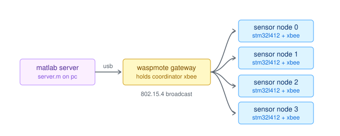
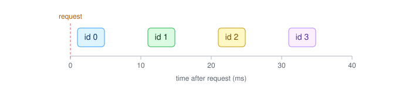
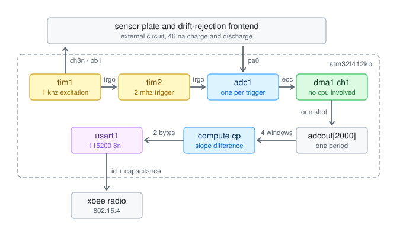
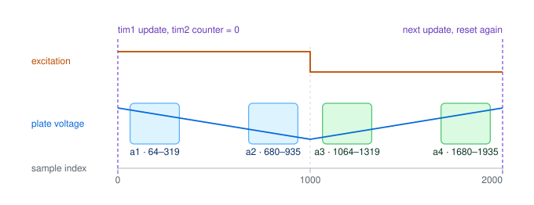

<div align="center">

# Capacitive Sensor Sync

**A 4-node wireless capacitive sensor network with drift-noise cancellation**

`STM32L412KB` · `Bare-metal C` · `XBee 802.15.4` · `MATLAB`

</div>

---

When a person moves near a metal plate, the plate's capacitance changes very slightly. Four sensor nodes track that change and send it over XBee radio to a MATLAB server, where the data can be used for presence detection.

Each node is an **STM32L412KB** with a **Digi XBee** radio. A **MATLAB** script broadcasts one request to all four nodes so their readings belong to the same instant, then collects the answers. The measurement method is from **"Drift Rejection Differential Frontend for Single Plate Capacitive Sensors"** (*IEEE Sensors Journal*) by G. Subbicini, L. Lavagno and M. T. Lazarescu. Supervised by Prof. Mihai Teodor Lazarescu, Politecnico di Torino.

> **Every configuration value** — clock tree, peripheral registers, XCTU radio settings, pin assignment — is in **[docs/configuration_reference.pdf](docs/configuration_reference.pdf)**.

---

## How it fits together



The PC connects to a **Waspmote Gateway** USB module, which carries the coordinator XBee and presents it as an ordinary COM port. That radio broadcasts to the four nodes over the air.

## One measurement round

1. MATLAB broadcasts a single letter, `r`.
2. Each node wakes, measures its plate, and gets a capacitance value — about a millisecond.
3. Each node waits its turn, set by its ID, then sends a two-byte answer.
4. MATLAB sorts the answers by the two ID bits at the top of each packet.



Step 3 matters: all four radios share one channel, so without the stagger the replies would collide and most would be lost.

## Inside a node



The node drives its plate with a 1 kHz square wave and watches the plate voltage ramp up and down. How *steeply* it ramps gives the capacitance — a larger capacitance charges more slowly.

The catch is drift. Slow leakage currents bend both ramps the same way, and that drift is easily larger than the signal we want. The method from the paper compares the two ramps against each other instead of measuring either alone, so the drift cancels.

Each measurement captures 2000 samples over one excitation period, averages four fixed slices, and solves for capacitance on-chip. Only the final number goes over the air.



The sampling must line up with the square wave identically every time, or those four fixed slices would drift across the waveform and the cancellation would break. Two timers handle it: TIM1 generates the excitation, TIM2 paces the ADC and is reset by TIM1 every cycle.

## What comes back

Two bytes per node. The top two bits carry the node ID, the remaining fourteen carry capacitance in steps of 0.1 pF. The value `0x3FFF` is reserved to mean the measurement failed, so a broken sensor is distinguishable from a node that never replied.

---

## Repository

| Folder | Contents |
|---|---|
| `keil_firmware/` | STM32 firmware, Keil µVision 5 project |
| `matlab_server/` | `server.m`, the coordinator script |
| `docs/` | Configuration reference and figures |
| `Useful_Material/` | Source paper and frontend schematic |

## Running it

**Flash each node.** Open `keil_firmware/MDK-ARM/mihai_code1.uvprojx`, set a unique ID, build and flash over ST-Link. Repeat per node.

```c
#define SENSOR_ID 1U      // 0, 1, 2 or 3 — different for every node
```

Set `DEBUG_UART_ENABLED` to `1` for readable output on the ST-Link COM port at 115200 baud.

**Configure each radio** in Digi XCTU before it goes into a board: same PAN ID, same channel, 802.15.4 firmware, transparent mode, 115200 baud. Exact values, including two pins that must stay disabled on this PCB, are in the [reference document](docs/configuration_reference.pdf).

**Run the server.** Plug in the gateway, set `portName` in `matlab_server/server.m`, and run. Results are saved to `four_transmitter_results.mat`.

```
----- Round 7 -----
ID=0, bytes=00 7B, packet=0x007B, value=  123, arrival=   2.14 ms
ID=1, bytes=40 82, packet=0x4082, value=  130, arrival=  12.07 ms
Round 7 timed out. Missing IDs: [2 3]
Stored: ID0=123, ID1=130, ID2=NaN, ID3=NaN
```

Values are in steps of 0.1 pF, and `16383` marks a failed measurement:

```matlab
sensorValues(sensorValues == 16383) = NaN;
capacitance_pF = sensorValues / 10;
```

---

## Reference

G. Subbicini, L. Lavagno and M. T. Lazarescu, "Drift Rejection Differential Frontend for Single Plate Capacitive Sensors," *IEEE Sensors Journal*, vol. 22, no. 16, pp. 16141–16149, 15 Aug. 2022. [doi:10.1109/JSEN.2022.3189031](https://doi.org/10.1109/JSEN.2022.3189031)

The full paper and the frontend schematic are in `Useful_Material/`.
